# CICS-COBOL application using REST API

We can use our deployed MLz Credit Risk Assessment AI model and integrate it into different types of applications. Guidance on integrating the AI model into a sample CICS-COBOL application using REST API is below.

In this type of CICS-COBOL program, we will be inferencing the Credit Risk Assessment model deployed into the MLz using REST API calls to a hosted UI. The UI will be making call to the MLz for scoring and the result will be sent back to the CICS-COBOL program.

All sample code for this section is within
```
ai-st-credit-risk-assessment/zST-model-integration-CICS
```

Prerequisuties:
- Must have access to z/OS CICS Environment
- Must have MLz installed
- Must have model deployed with the CICS scoring server as scoring service

## Get the model details for inferencing
1. Go to MLz UI
2. Go to deployment tab
3. Click on action button for your deployed model (on right side)
4. Click view details
5. Copy scoring endpoint

## Integrate into CICS application
A sample COBOL file for the below integration can be found here: `ai-st-credit-risk-assessment/zST-model-integration-CICS/CRAURL.cbl`

1. Create connection with the hosted UI, using the Web Open command. Mention the host number & port number where the UI is hosted.
    # 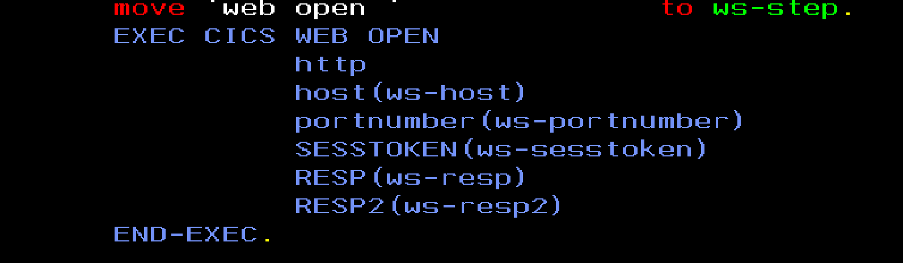

2. Using CICS ASSIGN get the  application id of the UI.
    # 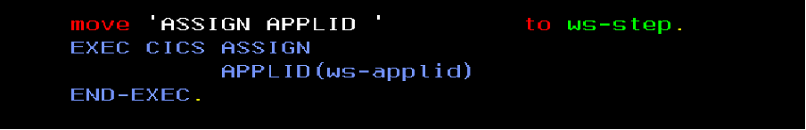

3. Supply all the inputs required by the UI service along with the API path of the inference.
    # 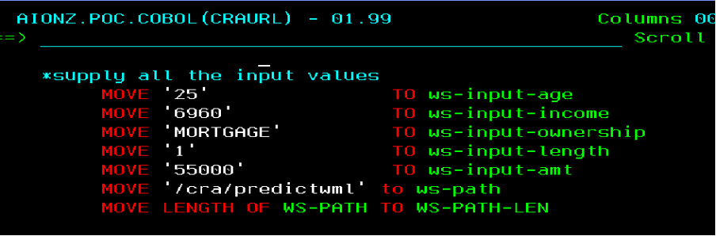

4. Prepare the json data for the REST API call using COBOL’s String statement.
    # 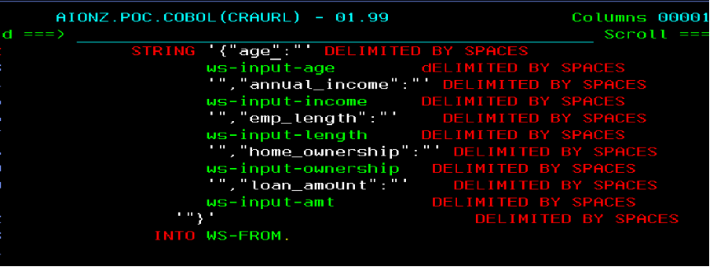

5. Use the web converse command in CICS to pass the data to the UI backend service and get the response.
    # 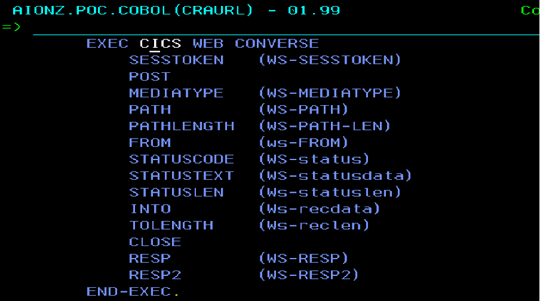

6. Close the web connection to the server.
    # 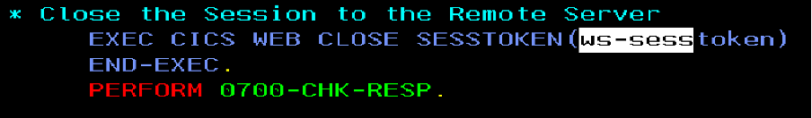

7. Process the response received from API call.
    # 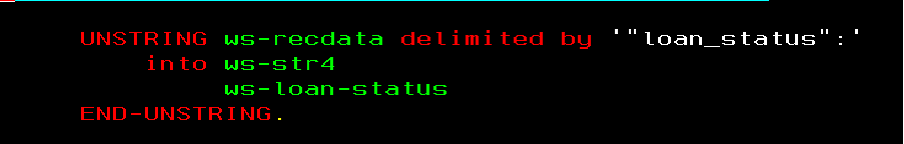

8. Handle the error codes as needed.
    # 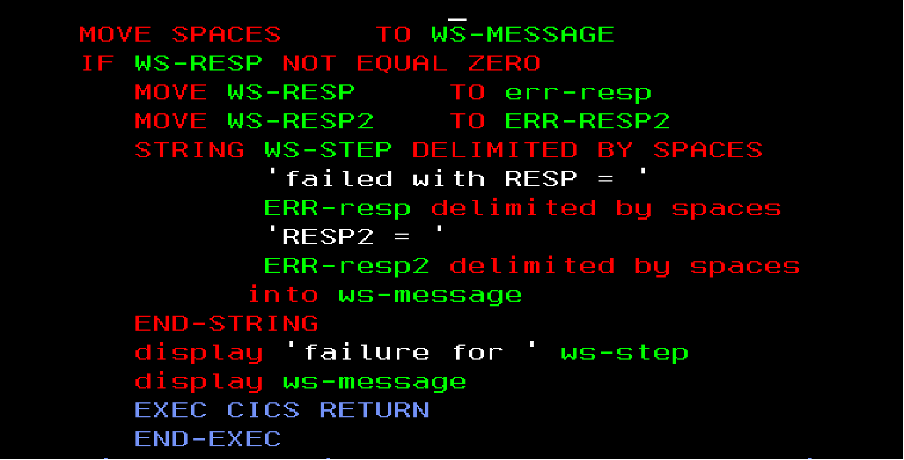

9. Compile the COBOL program (sample compile jcl provided here: `ai-st-credit-risk-assessment/zST-model-integration-CICS/COMPILE.jcl`).
    # 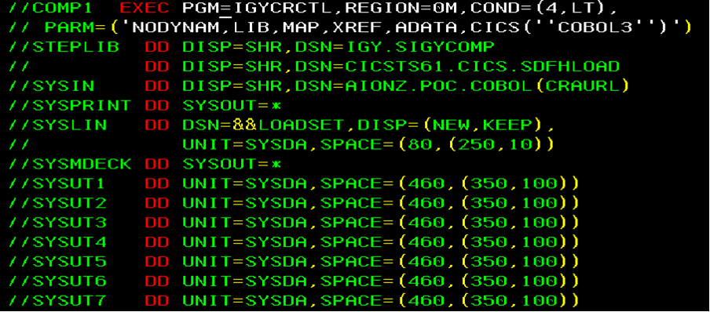

10. Define the Transaction: (COPY PASTE THE LINES ONE-BY-ONE)
    ```
    CEDA DEFINE TRANS(<transaction name>) GROUP(<group name>)                
    PROGRAM(<program name>)                                 
    DESCRIPTION(<transaction description>)
    ```
    # 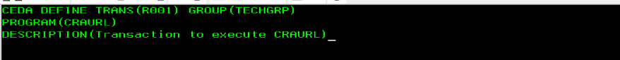

11. Define the Program:
    ```
    CEDA DEFINE PROGRAM(<program name>) GROUP(<group name>)                
    LANGUAGE(COBOL) DESCRIPTION(<program description>)
    ```
    # 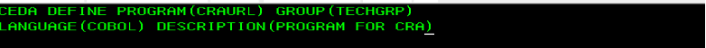

12. Install the transaction and program in the CICS region. Execute the below mentioned command to define the transaction replacing  `transaction name` with the transaction name,  `group name` with the name of the group &  `program name` with name of the COBOL program,  `transaction description` with appropriate description for the transaction, finally,  `program description` with appropriate description for the program.
    ```
    CEDA INS TRANS(<transaction name>) GROUP(<group name>)
    ```
    # 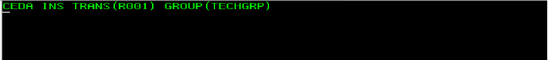
    ```
    CEDA INS PROGRAM(<program name>) GROUP(<group name>)
    ```
    # 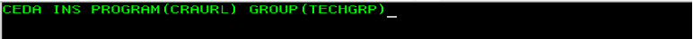

13. To invoke the transaction Type the transaction name and hit Enter. 
    # 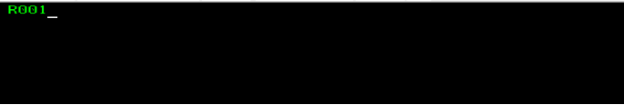

14. Verify the result 
- Lets go back to the TSO screen. Navigate to the Spool.
    # 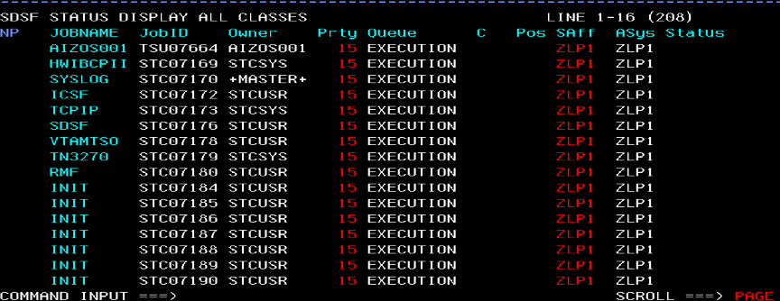

- To check the started task
    - Go to Spool pre `CICS*`. This will list the active CICS regions.
        # 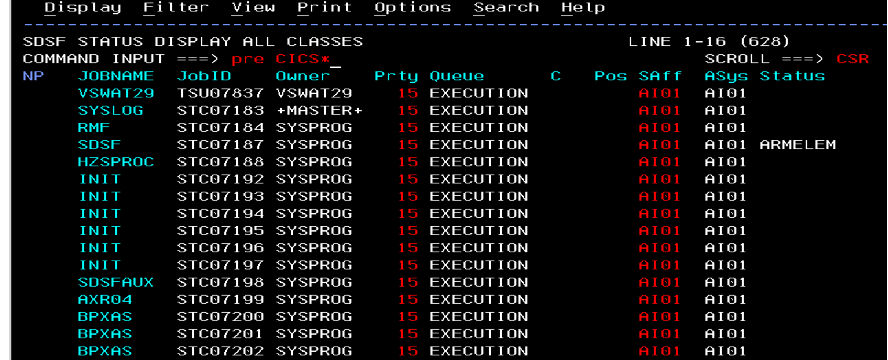
        # 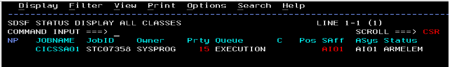
    - Put `?` to see the details of the Spool job.
        # 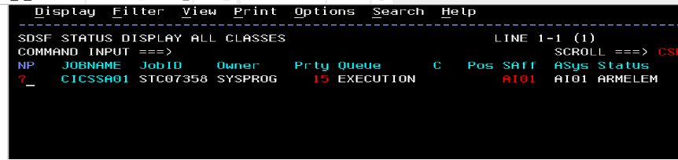
    - Check the `CEEMSG` dataset name
        # 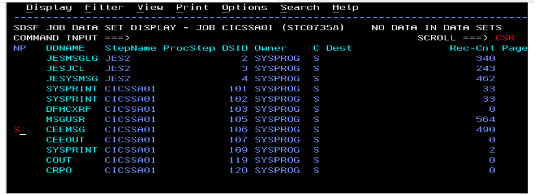
    - Check the displays from the module.
        # 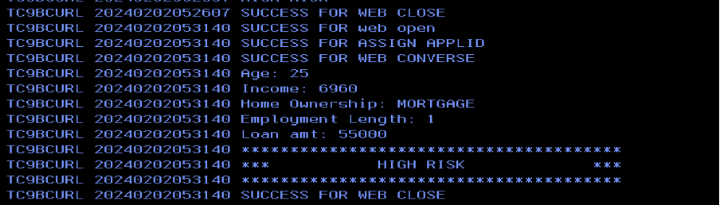
